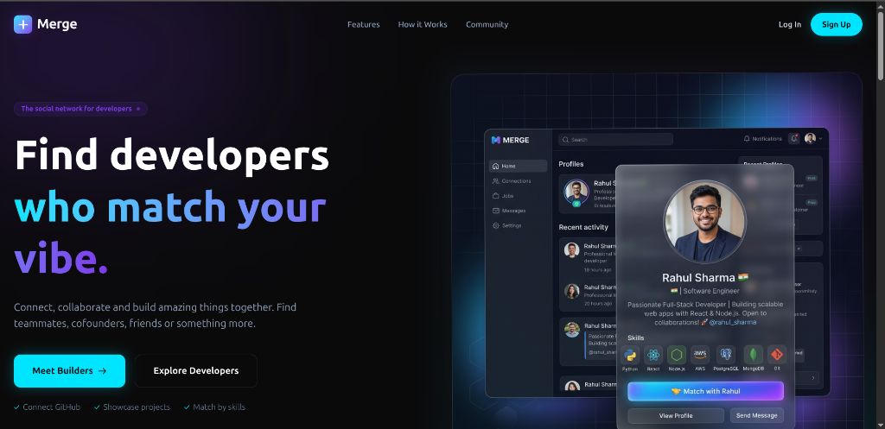
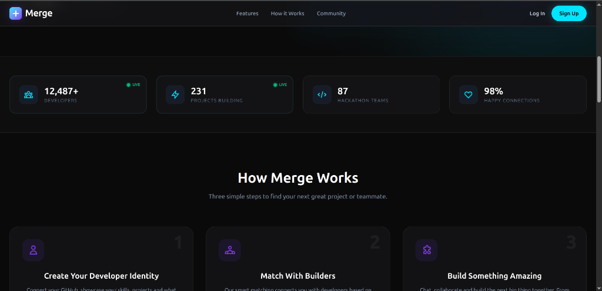
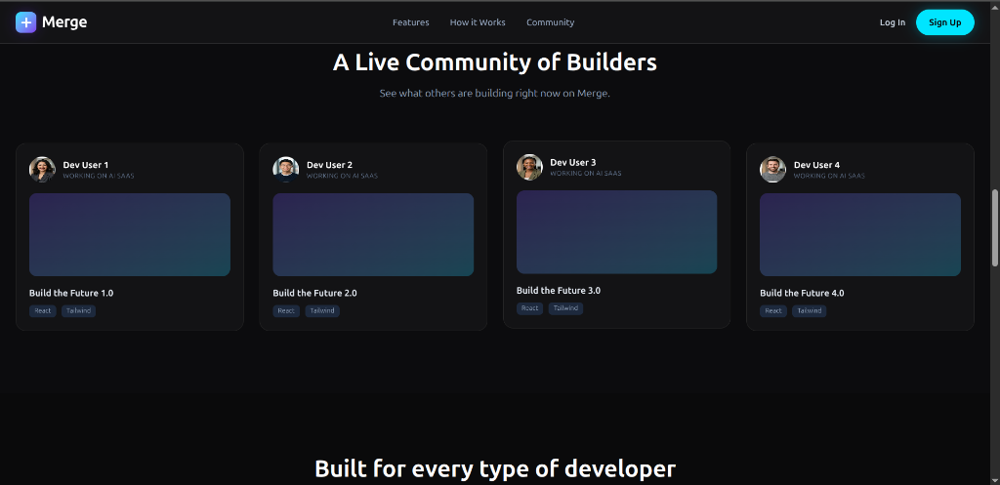
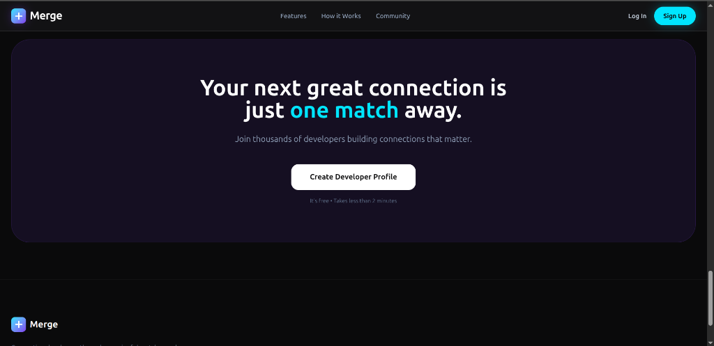

# 🚀 Merge

**The social network for developers. Find developers who match your vibe.**

[**🔴 Live Demo: https://merge-frontend-six.vercel.app/**](https://merge-frontend-six.vercel.app/)

## 📸 Screenshots

<details>
<summary>Click to expand screenshots</summary>

### Landing Page


### Features & Stats


### Live Community


### Create Profile


</details>

## 📖 About The Project

Merge is a dedicated platform designed for developers to connect, collaborate, and build amazing things together. Whether you are looking for a teammate for a hackathon, a co-founder for your next big startup, or just developer friends to share ideas with, Merge connects you with the right people based on your skills, interests, and goals.

Your next great connection is just **one match** away!

## ✨ Features

- **🧑‍💻 Create Your Developer Identity:** Connect your GitHub, showcase your technical skills, display the projects you are working on, and let others know what you are looking for.
- **🤝 Match With Builders:** Our smart matching connects you with developers who complement your skills and share similar interests. Swipe, connect, and start building.
- **💬 Build Something Amazing:** Once connected, use the built-in real-time chat to collaborate, plan, and build the next big thing together.
- **🌐 Live Community:** Browse the community, discover active developers, see what others are building right now, and join existing project teams.

## 🛠️ Tech Stack

This frontend application is built with modern web technologies:

- **Framework:** React 19 + Vite
- **Styling:** Tailwind CSS 4
- **Routing:** React Router v7
- **Animations:** Framer Motion
- **Real-time Communication:** Socket.io-client
- **HTTP Client:** Axios
- **Icons:** Lucide React
- **Language:** TypeScript

## 🚀 Getting Started

Follow these steps to run the frontend application locally:

### Prerequisites

- Node.js (v18 or higher recommended)
- npm or yarn

### Installation

1. Clone the repository and navigate to the frontend directory:
   ```bash
   cd merge_frontend
   ```

2. Install dependencies:
   ```bash
   npm install
   ```

3. Start the development server:
   ```bash
   npm run dev
   ```

4. Open your browser and visit `http://localhost:5173` to view the application.

## 🤝 Contributing

Contributions, issues, and feature requests are welcome! Feel free to check the issues page.
